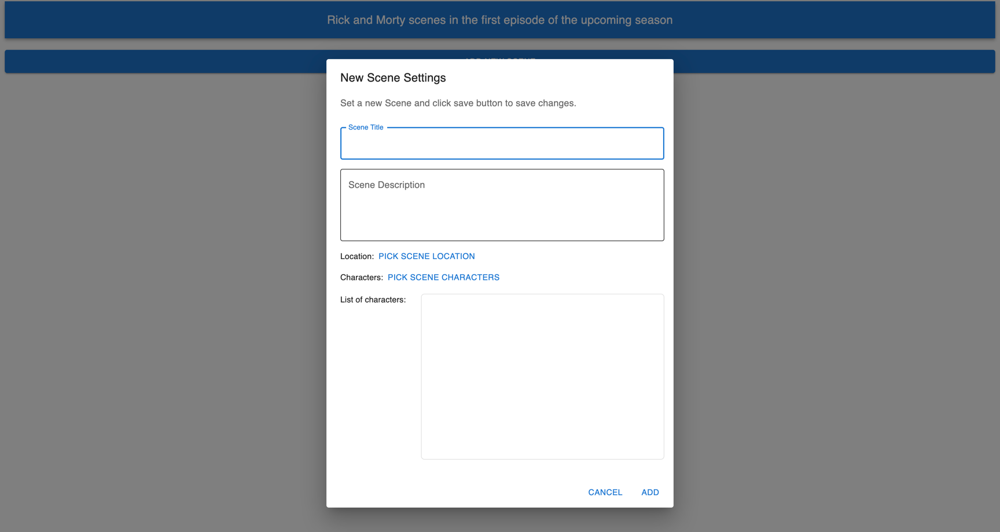

# 🧬 RickGraphQL

**RickGraphQL** is a modern web application that interfaces with the [Rick and Morty GraphQL API](https://rickandmortyapi.graphcdn.app/), allowing users to explore data from the Rick and Morty universe. Built with TypeScript, JavaScript, and Webpack, this project emphasizes performance and scalability.

🔗 **Live Demo**: [rick-graph-ql.vercel.app](https://rick-graph-ql.vercel.app)

---

## ✨ Features

- ⚡ **Fast and Responsive**: Optimized performance using Webpack.
- 🛠️ **TypeScript Support**: Strong typing for improved development experience.
- 🔍 **GraphQL API Integration**: Fetches data from [`rickandmortyapi.graphcdn.app`](https://rickandmortyapi.graphcdn.app/), a fast GraphQL wrapper around the Rick and Morty API.
- 📦 **Webpack Setup**: Custom Webpack configuration for efficient bundling and hot reloading.
- 🧩 **Modular Architecture**: Clean codebase with reusable and maintainable components.
- 🎨 **Customizable UI**: Designed for easy theming and layout adjustments.
- 🚀 **Deployed on Vercel**: Easily accessible live deployment.

---

## 🛠️ Getting Started

### 📋 Prerequisites

- 🟢 Node.js (v14 or higher)
- 📦 npm or yarn

### 📸 Preview

